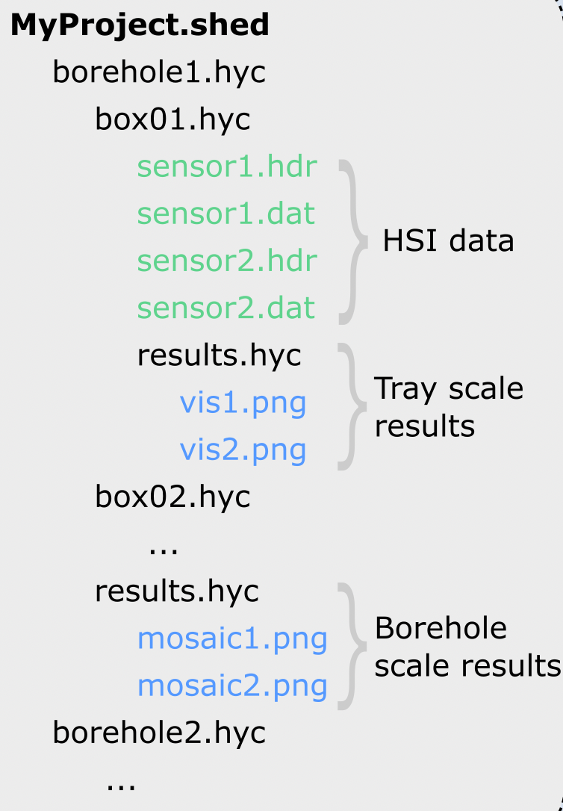

# Hycore

### About

`hycore` provides a flexible data structure for creating, managing and analysing hyperspectral drillcore datasets using python and [`hylite`](https://github.com/hifexplo/hylite).

It provides a python interface for managing and querying hierarchical directory structures (called "sheds") containing a directory for each drillcore and, within this, a directory for each core box. `hycore` facilitates seamless loading (and, after processing, saving) of hyperspectral images from these box directories, as well as other common tasks like building drillcore mosaics.

----

<i>
Outline of the directory structure used by `hycore` for simply managing hyperspectral drillcore databases.
<i>
  
----
  
### Demonstration

For an introduction into the structure of `hycore` and how to use it to create and run customised workflows, please see the `demonstration.ipynb` file. 

### Documentation

Documentation for `hycore` can be found here:

[https://samthiele.github.io/hycore/hycore.html](https://samthiele.github.io/hycore/hycore.html)

### Citation

If `hycore` has been useful for your work, please cite:

> Thiele, S., Kirsch, M., Lorenz, S., Saffi, H., El Alami, S., Contreras Acosta, I.C., Madriz, Y., and Gloaguen, R., 2024. 
> "Maximising the value of hyperspectral drill core scanning through real-time processing and analysis", Frontiers in Earth Science [ Under Review ]
